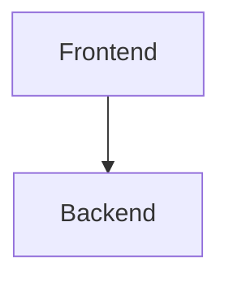

# Uptime Monitor Documentation

This is the enterprise-grade documentation site for the Automated Server Uptime Monitor, built with [Docusaurus 3](https://docusaurus.io/).

## 🚀 How to update documentation during development

As you build new features or make architectural changes, you should keep the documentation in sync. Here is the standard workflow:

### 1. Run the local dev server
Always run the dev server while writing docs to see your changes live:
```bash
cd docs
npm install
npm start
```
The site will be available at `http://localhost:3000` (or `3001` if 3000 is taken).

### 2. Create or Edit Markdown Files
All documentation content lives in the `docs/docs/` directory. Find the appropriate category folder and edit the existing `.md` files or create new ones.

**Frontmatter:**
Every new `.md` file must start with YAML frontmatter:
```markdown
---
id: my-new-page
title: My New Page
sidebar_position: 5
---

# My New Page
Content goes here...
```

### 3. Update the Sidebar (`sidebars.ts`)
If you create a **new** file, you must add it to the navigation menu.
Open `docs/sidebars.ts` and add your file's ID (the path relative to the `docs/` folder, without the `.md` extension) to the appropriate category array.

For example, if you created `docs/docs/frontend/new-component.md`, add `'frontend/new-component'` to the `04 · Frontend` category in `sidebars.ts`.

### 4. Adding Images and Assets
Place any images or diagrams in the `docs/static/img/` directory.
Reference them in your markdown files using absolute paths starting from the root:
```markdown

```

### 5. Using Mermaid Diagrams
You can generate diagrams using code blocks with the `mermaid` language tag:
````markdown

````

## 📁 Documentation Structure Guide

When adding new content, follow this organization:

- **`project-overview/`**: High-level goals, tech stack, and timeline.
- **`architecture/`**: System diagrams, database design, and data flows.
- **`api-reference/`**: REST API endpoints, auth, and error codes.
- **`frontend/`** & **`backend/`**: Implementation details, component libraries, state management, routing, controllers, etc.
- **`database/`**: Schemas, migrations, indexing.
- **`devops/`**: Docker, CI/CD pipelines, environments.
- **`testing/`**: Test strategies, unit/e2e tests.
- **`security/`**: Data protection, auth mechanisms.
- **`operations/`**: Logging, monitoring, alerts.
- **`developer-guide/`**: Contributing rules, coding standards, git workflow.
- **`adr/`**: Architecture Decision Records. Add a new ADR here whenever you make a major technical choice (e.g., picking a new library or changing a pattern).

## 🚀 Deployment

The documentation is configured to deploy automatically via GitHub Actions to GitHub Pages.
When you push changes to the repository, the CI/CD pipeline will run `npm run build` and deploy the output in the `build/` directory to the `gh-pages` branch.
