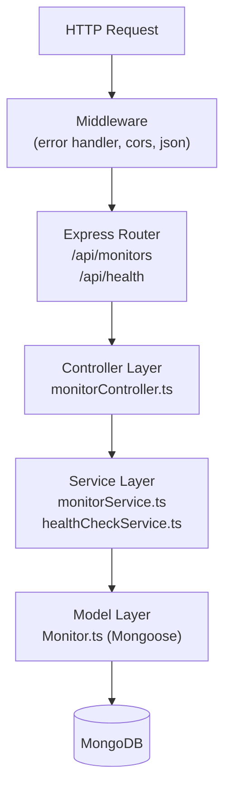
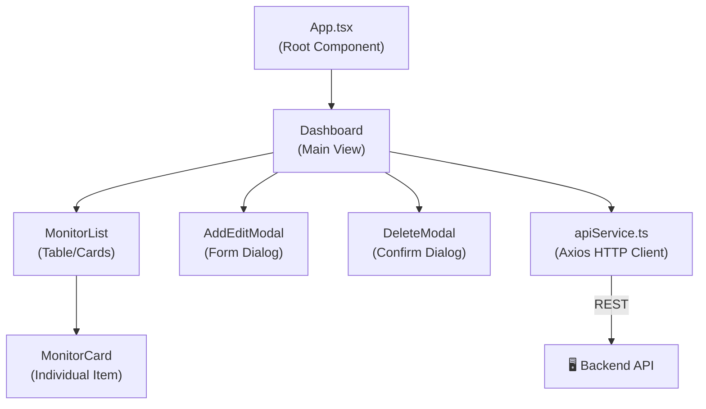

# 🔷 Component Diagram

## Backend Component Breakdown

```mermaid
graph TD
    HTTP["HTTP Request"]
    Router["Express Router\n/api/monitors\n/api/health"]
    MW["Middleware\n(error handler, cors, json)"]
    Controller["Controller Layer\nmonitorController.ts"]
    Service["Service Layer\nmonitorService.ts\nhealthCheckService.ts"]
    Model["Model Layer\nMonitor.ts (Mongoose)"]
    MongoDB[("MongoDB")]

    HTTP --> MW --> Router --> Controller --> Service --> Model --> MongoDB
```

## Frontend Component Breakdown

```mermaid
graph TD
    App["App.tsx\n(Root Component)"]
    Dashboard["Dashboard\n(Main View)"]
    MonitorList["MonitorList\n(Table/Cards)"]
    MonitorCard["MonitorCard\n(Individual Item)"]
    AddEditModal["AddEditModal\n(Form Dialog)"]
    DeleteModal["DeleteModal\n(Confirm Dialog)"]
    ApiService["apiService.ts\n(Axios HTTP Client)"]
    Backend["🖥️ Backend API"]

    App --> Dashboard
    Dashboard --> MonitorList
    Dashboard --> AddEditModal
    Dashboard --> DeleteModal
    MonitorList --> MonitorCard
    Dashboard --> ApiService
    ApiService -->|REST| Backend
```
