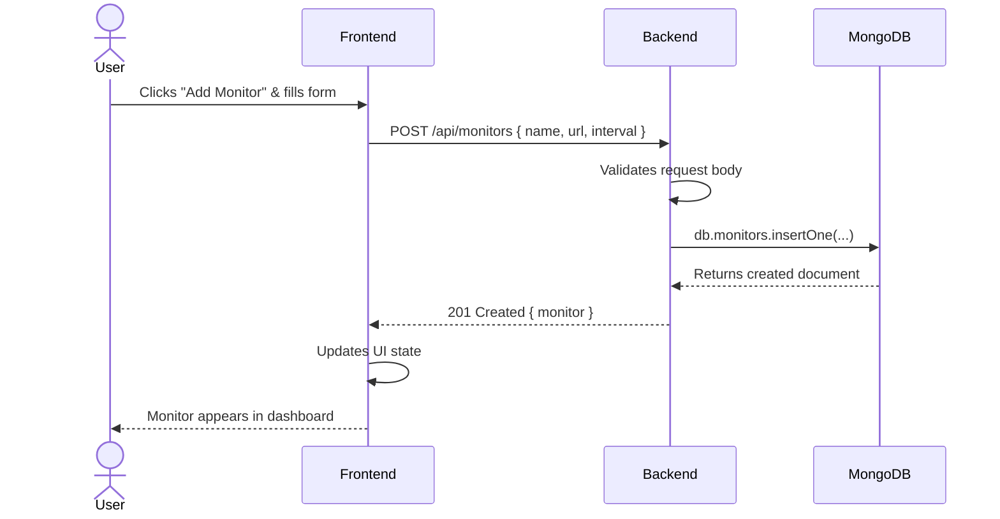
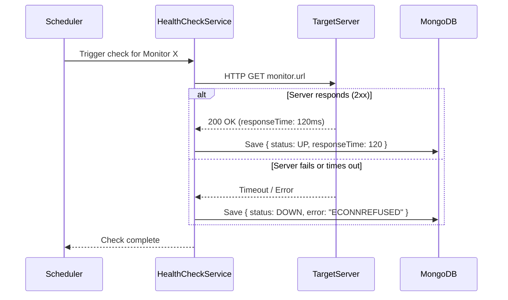

# 🔄 Data Flow Diagram

## User Adds a Monitor

```mermaid
sequenceDiagram
    actor User
    participant Frontend
    participant Backend
    participant MongoDB

    User->>Frontend: Clicks "Add Monitor" & fills form
    Frontend->>Backend: POST /api/monitors { name, url, interval }
    Backend->>Backend: Validates request body
    Backend->>MongoDB: db.monitors.insertOne(...)
    MongoDB-->>Backend: Returns created document
    Backend-->>Frontend: 201 Created { monitor }
    Frontend->>Frontend: Updates UI state
    Frontend-->>User: Monitor appears in dashboard
```

## Health Check Lifecycle

```mermaid
sequenceDiagram
    participant Scheduler
    participant HealthCheckService
    participant TargetServer
    participant MongoDB

    Scheduler->>HealthCheckService: Trigger check for Monitor X
    HealthCheckService->>TargetServer: HTTP GET monitor.url
    alt Server responds (2xx)
        TargetServer-->>HealthCheckService: 200 OK (responseTime: 120ms)
        HealthCheckService->>MongoDB: Save { status: UP, responseTime: 120 }
    else Server fails or times out
        TargetServer-->>HealthCheckService: Timeout / Error
        HealthCheckService->>MongoDB: Save { status: DOWN, error: "ECONNREFUSED" }
    end
    HealthCheckService-->>Scheduler: Check complete
```
